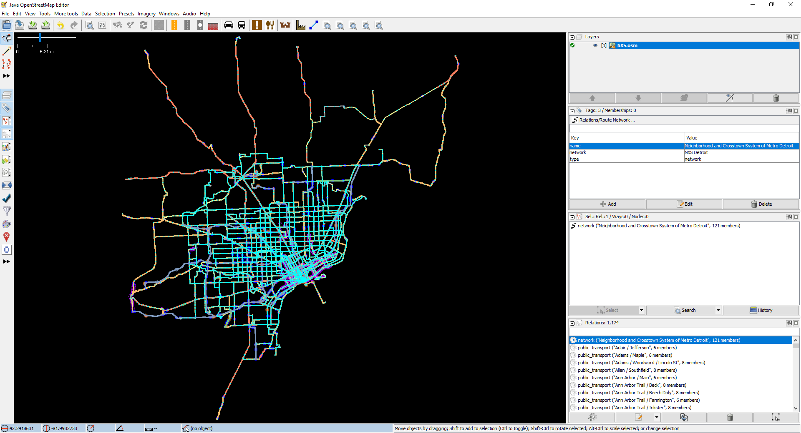
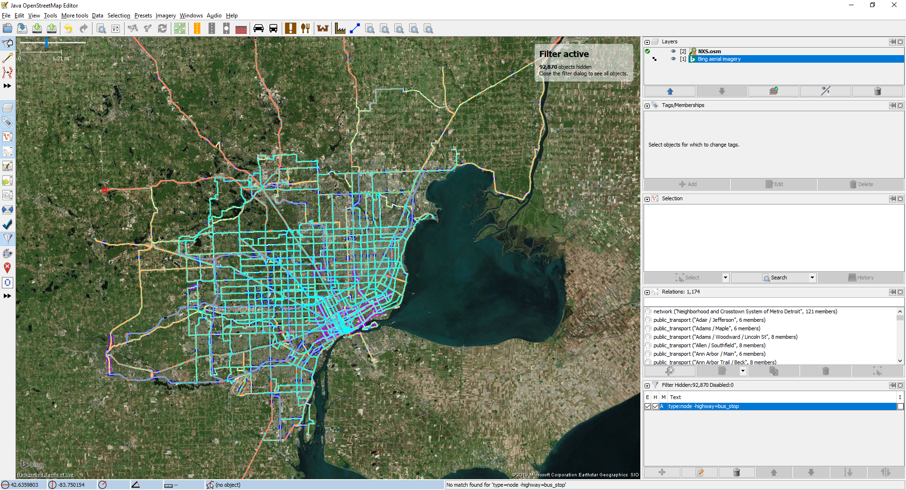
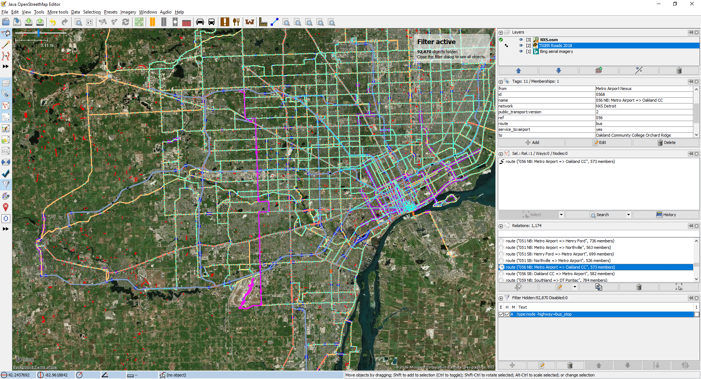

This repository contains route and stop data for NXS routes.

# How to use
The files are in the [standard OpenStreetMap XML format](https://wiki.openstreetmap.org/wiki/OSM_XML), except for [the changes JOSM makes](https://wiki.openstreetmap.org/wiki/JOSM_file_format).

The easiest way to view the data contained herein is, therefore, to open it in [JOSM](https://josm.openstreetmap.de/).

When you first open the file, your editor will probably look like this:

It is recommended that you open the Filters panel (Windows > Filter, or press alt-shift-F), and add the following filter: `type:node -highway=bus_stop`. Then, if desired, you can get a satellite imagery background by opening the Imagery menu and selecting "Bing aerial imagery", then open it again, select "Imagery not matching any other category", and select "TIGER Roads 2018". Your view should now look like this: 

You can navigate the map by *right-*click-and-dragging, or using ctrl+arrow keys; you can zoom with the scroll wheel (without any keys) or using the +/- keys.

You can select objects by left-clicking. If you select a bus stop, you can see the properties ("Tags") of the stop and all the routes that stop there by scrolling through the "Tags / Memberships" view.

To see a whole route at once, scroll down the "Relations" view until you see the routes, then find the `route` you wish to view and double-click it. All the roads and stops used by the route will be highlighted magenta, though it won't automatically put the route in view (you can press 3 on your keyboard to accomplish that). So now your view might look like: 

# Notes on realism
Although NXS is set in the real world, there are some major changes to the roads that have been made in this version of it.

* The roads used by major bus routes have bus lanes on them, such as Michigan, Woodward, and Gratiot, when possible.
* Highways have bus lanes closest to the *median*, as well as ramps in the median that only buses are allowed to use. This is so that car traffic doesn't have to cross bus lanes, nor do buses have to cross car lanes, to enter and exit.
* Since NXS is set in a world where public transit is better funded and more appreciated than SMART/DDOT are, there may be some minor changes to sidewalk infrastructure. These changes *aren't* reflected in this map, as this map is bus routes only.

# Tags
The entities in the file are tagged (and relations membered) as follows, in addition to the standards on the [OpenStreetMap wiki](https://wiki.openstreetmap.org/):

*Note: Older files may not match the tagging scheme exactly. They will not be updated to account for new schemes of newer files.*

## templates
Any object with the tag `template`=`yes` should be ignored.

## `network`
The network relation is the entire transport system. It contains as its members all the `route_master`s operated by the system.

## `route_master`
Tags:
* `category` describes the official category of the route, as seen in [table A](#a-route-categories).
* `charge` is the cost of riding NXS buses. Other discounts do exist, but in its most basic form, a single payment covers three hours of unlimited riding.
* `colour` is the color that a route should be mapped at, or the background color of the route on GTFS.
* `name` is *the actual route name*, prefixed by its number for sorting. This is because:
  * The routes actually *have* names
  * The "approved" format is one that's computable from the other values anyways and so I believe that should be kept *to* those values and the consumers that want to compute it that way, while the consumers that actually care about routes should use the name as a real name.

Relation members:
* The roles of the `route` members of `route_master`s describe the direction of the given `route`. This is because the GTFS standard allows the producer to specify when one trip is in the opposite direction from another ([`direction_id` in `trips.txt`](https://developers.google.com/transit/gtfs/reference/#tripstxt)).

## `route`
Tags:
* `24hour` indicates that a particular route variant runs 24 hours a day.
* `deviation_range` is how far from the route variant a stop can be specially requested. Deviations are based on the *roads* used by the route, so a value of `0 mi` still means anywhere on the road (whereas a lack of value means fixed stops only).
* `id` is an internal ID used by NXS for scheduling. A tag is used instead of the actual ID of the relation because the IDs of non-uploaded entities are not guaranteed to be consistent.
* `name` is a semi-descriptive name for the variant. While most names are something like "25 Eastbound", names are not guaranteed to be a specific format and are there to be human readable and disambiguate variants.
* `service_to:airport`=`yes` means the route goes to Detroit Metro Airport.
* `service_to:downtown`=`yes` means the route goes to Downtown Detroit.

Relation members:
* The relation starts by alternating the following for each stop along the route:
  * The `public_transport`=`stop_area` indicating where the bus stops, with a role that starts with `stop`; the same stop corresponding to the next platform.
  * The `public_transport`=`platform` indicating where the passengers wait, with a role that starts with `platform`; the same platform corresponding to the previous stop.
* The stops and platforms may also have the following within their roles (not all of these are currently used). Note that unless otherwise specified below, GTFS `pickup_type` and `drop_off_type` are both 0, and 1 takes precedence over 2/3.
  * `_timing`: The given bus stop is a timepoint along the route.
  * `_exit_only`: The given bus stop only allows passengers to deboard the bus; no passengers may board. (GTFS `pickup_type` 1)
  * `_entry_only`: The given bus stop only allows passengers to board the bus; no passengers may deboard. (GTFS `drop_off_type` 1)
  * `_no_entry_or_exit`: Passengers may not board *or* deboard the bus at the given stop; it exists only for timing purposes, or the passengers must deboard and reboard e.g. at international customs. (GTFS `pickup_type` 1, `drop_off_type` 1)
  * `_break_` followed by a number: For scheduling purposes, a break of that many minutes should be included between arriving at and departing the stop.
  * `_by_request`: The stop is served but only upon request (GTFS `pickup_type` 3, `drop_off_type` 2)
  * `_unscheduled`: The stop is part of the route, but is disregarded when timing the route.
* Then the stops and platforms are followed by all the ways on which the bus travels. Ways may have the following roles (not all of these are currently used):
  * `flag`: Passengers may flag the bus down along this portion of the route. Flag ways may also have `_exit_only` or `_entry_only`, with the same meanings as above.
    * `flag` role is implied on all ways of an `edge` route that aren't specifically marked as `no_flag`.
  * `deviated`: Passengers may request deviations up to the specified distance away from this portion of the route. Deviated ways may also have `_exit_only` or `_entry_only`, with the same meanings as above.
    * `deviated` role is implied on all ways of a `deviated` route that aren't specifically marked as `no_deviated`.

## Stop areas:
Tags:
* `stop_area_type` has values explained in [table B](#b-stop-area-types).

Relation members:
* The `public_transport`=`stop_position`, with role `stop`, followed by the `public_transport`=`platform`, with role `platform`, for each stop in the area.

## Bus stops:
* Are tagged both `public_transport`=`platform` and `highway`=`bus_stop` for cross-compatibility purposes.
* Some tags indicate amenities available at the stop:
  * `bench`=`yes` indicates that the stop provides a bench for sitting.
  * `shelter`=`yes` indicates that the stop provides a shelter from the elements.
* Some tags indicate that certain types of limited-stop routes serve the stop:
  * `limited`=`yes` indicates that routes 201, 505X, and/or 605X stop there (the standard limited-stop routes)
  * `fast_line`=`yes` indicates that the Fast Line routes stop there
  * `edge`=`yes` indicates that the stop is a signed stop for Edge routes; however a stop doesn't need to have this tag for Edge routes to stop at it.
* Some tags indicate things a sign says:
  * `not_served_by` indicates routes that pass a stop, but are explcitily marked by the sign as not serving it.
  * `inscription` indicates any other non-standard information that is written on the stop's sign.
* `ref` is the ID of the stop according to the NXS website and bus tracker system. Such a tag is mapped on the stop itself.

# Tables

## A: Route categories
|Value of `category`|Description|Possible numbers|Numbers currently in use|
|-:|:-|:-:|:-:|
|`crosstown`|Those routes which go across a long distance, most on a relatively straight line, usually across county borders.|1-89|1-83|
|`deviated`|Those routes which allow a deviation of up to a mile from the actual route.|180-789, second digit 8|580-680|
|`downtown`|Those routes which serve Downtown Detroit, but are otherwise not special.|100-709, second digit 0|100-709|
|`express`|Those routes which provide express service on highways, but not to Detroit Metro Airport. Most, but not all, go downtown|810-899|810-896|
|`edge`|Those routes which provide service to the outer edges of the counties, including flag stops anywhere along the route|900-949|900-944|
|`event`|Routes which provide scheduled service to recurring events.|960-989|960-963|
|`international`|Those routes which provide any service across the US-Canada border.|950-959|950-952|
|`fast`|Routes which provide BRT level service, as defined by the FTA.|Fast Line routes are not numbered.|(see left)|
|`mainline`|Those routes which have none of the other features described here.|110-779, second digit 1-7|115-750|
|`sky`|Those routes which provide express service to Detroit Metro Airport on highways.|800-809|800-807|
|`temporary`|Routes which provide temporary and instantaneous service. May come and go without warning.|990-999|(always changing)|

## B: Stop area types
|Value of `stop_area_type`|Description|
|-:|:-|
|`nexus`|A Nexus, one of NXS's twelve transit centers.|
|`park_and_ride`|A Park & Ride lot, where NXS customers can park their cars for convenient bus service. Usually, the stops are roadside stations.|
|`roadside_station`|A Roadside Station; enclosed, climate-controlled stations with real-time arrival information boards, wi-fi, and machines to supply/load Rosa Cards.|
|`transfer_point`|Standard bus stops, but a place to transfer between routes.|
|`standard`|Standard bus stops worthy of no note whatsoever. `standard` stop areas are usually places that used to be transfer points, but then routes changed.|